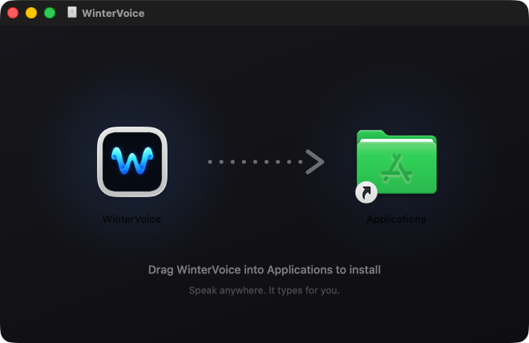

<div align="center">


# WinterVoice

**Free, open-source voice dictation for macOS — private, on-device speech‑to‑text powered by Whisper.**

Hold a key. Speak. Release. Your words appear in any app — 100% offline, no subscription, no account.

🤖 **Built for vibe coding** — speak your prompts straight into Claude Code, Cursor, ChatGPT, or any AI agent, instead of typing them. [See how →](#-made-for-vibe-coding--talk-to-your-ai-agents)

**English · Tiếng Việt · 90+ languages**

[**⬇️ Download for Mac (.dmg)**](https://github.com/winterzxzz/winter_voice/releases/latest)

[](https://github.com/winterzxzz/winter_voice/releases/latest)
[](https://github.com/winterzxzz/winter_voice/releases)
[](https://github.com/winterzxzz/winter_voice/releases/latest)
[](https://github.com/winterzxzz/winter_voice/releases/latest)
[](WinterVoice)
[](LICENSE)
[](#-made-for-vibe-coding--talk-to-your-ai-agents)
[](https://github.com/winterzxzz/winter_voice/stargazers)


</div>

---

## What is WinterVoice?

WinterVoice is a **native macOS dictation app** that turns your voice into text in *any* application — Slack, Notes, your browser, your IDE. It runs [whisper.cpp](https://github.com/ggml-org/whisper.cpp) **entirely on your Mac**, so your voice never leaves your machine. Prefer your own server? Point it at any **OpenAI-compatible transcription API** instead.

It's the free, private alternative to paid dictation tools — built with SwiftUI, for Apple Silicon. And it shines brightest in the AI era: **dictate your prompts into Claude Code, Cursor, or ChatGPT** instead of typing them.

## ⬇️ Download

**[Grab the latest `.dmg` from Releases →](https://github.com/winterzxzz/winter_voice/releases/latest)**

<p align="center"></p>

1. Open `WinterVoice.dmg` and drag **WinterVoice** into **Applications**.
2. First launch: the app is not notarized yet, so macOS may warn you. Either **right‑click → Open → Open**, or run:

   ```sh
   xattr -cr /Applications/WinterVoice.app
   ```

3. Follow the built-in permission wizard (Microphone, Input Monitoring, Accessibility) — WinterVoice needs exactly these three, nothing more.
4. Download a Whisper model on the **Transcription** page (checksums verified automatically) and start dictating.

> Building from source instead? See [docs/DEVELOPMENT.md](docs/DEVELOPMENT.md).

## ✨ Features

| | |
|---|---|
| 🤖 **Voice-prompt your AI agents** | Hold the key in Claude Code, Cursor, or ChatGPT and just say the prompt — speaking beats typing for long, context-rich instructions. |
| 🌊 **Floating widget with live waveform** | A draggable, always-on-top pill with exactly two moods: the brand mark at rest, and a 7-band voice-reactive waveform while you speak. |
| 🔒 **100% private, offline speech-to-text** | On-device Whisper transcription. Audio is never persisted, never uploaded, never logged. |
| ⌨️ **Global push-to-talk hotkey** | Hold Fn/Globe (or any key/modifier chord you record) to dictate into whatever app is focused. |
| 🌍 **90+ languages, Vietnamese included** | Multilingual Whisper models with a dedicated language picker — great for Vietnamese speech-to-text on Mac. |
| 📝 **Types into any app** | Inserts text directly at your cursor via Accessibility, with a safe clipboard fallback that restores your clipboard afterwards. |
| ☁️ **Bring your own API (optional)** | Any OpenAI-compatible `/audio/transcriptions` endpoint — your server, your key (stored locally on your Mac). |
| 📚 **Personal dictionary** | Auto-replace phrases before insertion — fix names, jargon, and Whisper quirks once. |
| 🕘 **Local history** | Searchable dictation history stored only on your Mac. Secure fields are never recorded. |
| 🖥️ **Native & lightweight** | SwiftUI menu-bar app with a floating recording overlay. No Electron, no telemetry, no account. |

## 🚀 How it works

1. **Hold** your push-to-talk key — a floating overlay shows it's listening.
2. **Speak** — audio is captured as 16 kHz mono PCM in memory only.
3. **Release** — Whisper transcribes on-device, your dictionary rules apply, and the text lands at your cursor.

## 🔐 Privacy, by design

- Local transcription runs on the pinned, checksum-verified **whisper.cpp v1.8.3** XCFramework; models are official artifacts verified by SHA-256.
- Audio lives in memory only — it is **never written to disk**.
- History stores text + timestamps locally; text dictated into password/secure fields is never recorded.
- Remote mode is opt-in, generic, HTTPS-first, and stores the API key **locally on your Mac** with owner-only file permissions.
- Exactly three permissions, each explained in-app: Microphone, Input Monitoring, Accessibility.

## 💻 Requirements

- **macOS 14 (Sonoma) or later**
- **Apple Silicon** (M1/M2/M3/M4) first-class
- ~80 MB–500 MB disk for a Whisper model (Tiny/Base/Small)

## 🤖 Made for Vibe Coding — Talk to Your AI Agents

Typing long prompts is the bottleneck of vibe coding. WinterVoice removes it: **hold a key, describe what you want, release** — your words land in the agent's input box, ready to send.

Works with every agent, because WinterVoice types wherever your cursor is:

- **Claude Code & terminal agents** — dictate instructions straight into the terminal
- **Cursor · Windsurf · VS Code Copilot** — speak entire feature requests into the chat panel
- **ChatGPT · Claude · Gemini** — brain-dump context, specs, and bug reports hands-free
- **Code review & issues** — narrate PR comments and GitHub issues instead of typing them

**Why voice-prompt your agents?**

- Speaking is ~3× faster than typing — you give richer prompts with more context, and richer prompts get better output
- Long prompts stop feeling like a chore, so you actually write them
- The personal dictionary fixes misheard jargon once ("j son" → "JSON", "winter voice" → "WinterVoice")
- Transcription runs 100% offline — your prompts stay on your Mac until you press Enter

## ❓ FAQ

<details>
<summary><b>Is WinterVoice free?</b></summary>
Yes — free and open source. No subscription, no account, no trial limits.
</details>

<details>
<summary><b>Does it work offline?</b></summary>
Yes. Local mode runs whisper.cpp entirely on your Mac. Internet is only needed once, to download a model.
</details>

<details>
<summary><b>Does it support Vietnamese speech-to-text?</b></summary>
Yes — import a multilingual Whisper model (Settings → Transcription → Import Model…) or use Remote mode, then set the language to Vietnamese (or leave auto-detect on). Tiếng Việt hoạt động tốt với model multilingual.
</details>

<details>
<summary><b>How is this different from macOS built-in dictation?</b></summary>
WinterVoice gives you push-to-talk from any app, open Whisper models you choose, a personal auto-correct dictionary, searchable history, and the option to use your own transcription server — all open source.
</details>

<details>
<summary><b>macOS says the app "cannot be opened". What do I do?</b></summary>
The build isn't notarized yet. Right-click the app → <b>Open</b> → <b>Open</b>, or run <code>xattr -cr /Applications/WinterVoice.app</code> once.
</details>

<details>
<summary><b>Can I use it to talk to Claude Code, Cursor, or ChatGPT?</b></summary>
Yes — that's the headline use case. WinterVoice inserts text wherever your cursor is, so any agent input works: terminals, IDE chat panels, browser chatbots. Hold the key, speak the prompt, release, press Enter.
</details>

<details>
<summary><b>Can I get fast cloud transcription for free?</b></summary>
Yes — run a local OpenAI-compatible router like 9router and point it at a provider with a free STT tier (e.g. Groq's whisper-large-v3-turbo). Full walkthrough: <a href="docs/free-cloud-stt-9router.md">Free cloud STT with 9router</a>.
</details>

<details>
<summary><b>Which Whisper models are available?</b></summary>
The built-in catalog ships English Tiny, Base, and Small, downloaded from official whisper.cpp sources and verified against published SHA-256 checksums. For every other language — or bigger brains — use <b>Import Model…</b> in Settings → Transcription to bring any ggml whisper <code>.bin</code>: multilingual Medium, Large-v3, quantized builds, fine-tunes.
</details>

## 📸 Also from the same maker

**[WinterShot](https://github.com/winterzxzz/winter_shot)** — free, open-source screenshots and screen recording for macOS. Freeze the screen, annotate, beautify, and record with a Screen Studio-style editor that zooms where you click. 100% on-device.

> Same house style, same privacy stance: native SwiftUI, on-device, no account. **Dictate with WinterVoice, screenshot with WinterShot.**

## 🤝 Contributing

Stars, issues, and PRs are all welcome — if WinterVoice saves you typing, **give it a ⭐ so more people find it**.

## ⭐ Star history

[](https://star-history.com/#winterzxzz/winter_voice&Date)

## 📄 License

[MIT](LICENSE) — free to use, modify, and distribute.

---

<div align="center">
<sub><b>Keywords:</b> macOS dictation app · speech to text Mac · voice typing macOS · offline transcription · whisper.cpp GUI · Whisper macOS · Vietnamese speech recognition · push-to-talk dictation · private voice-to-text · free Mac dictation software · vibe coding voice input · dictate AI prompts · talk to Claude Code · Cursor voice input · voice to text for ChatGPT</sub>
</div>
