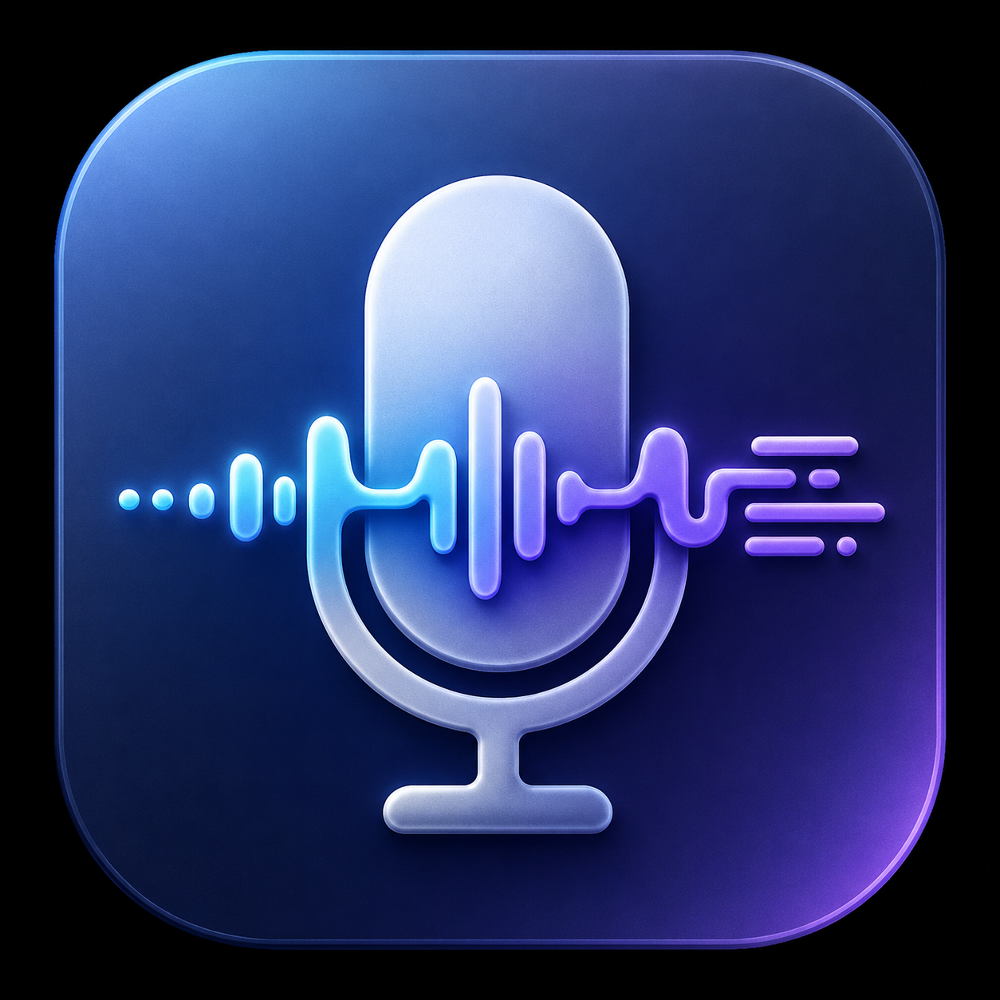
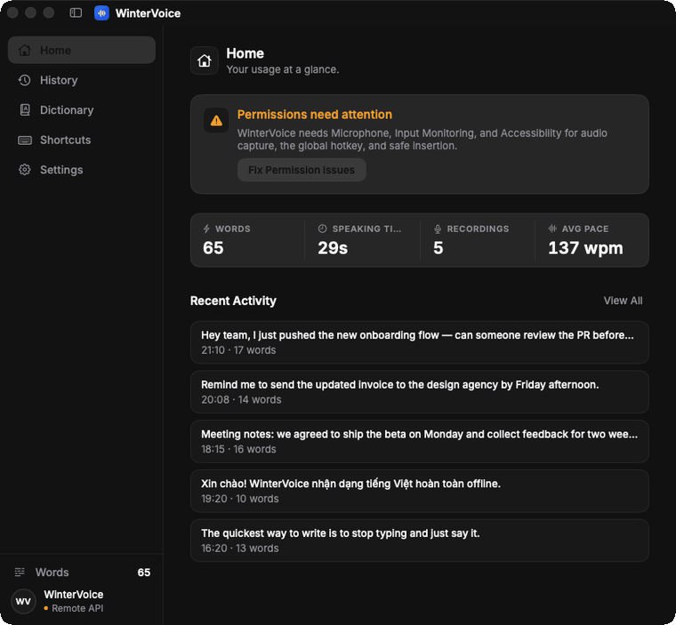
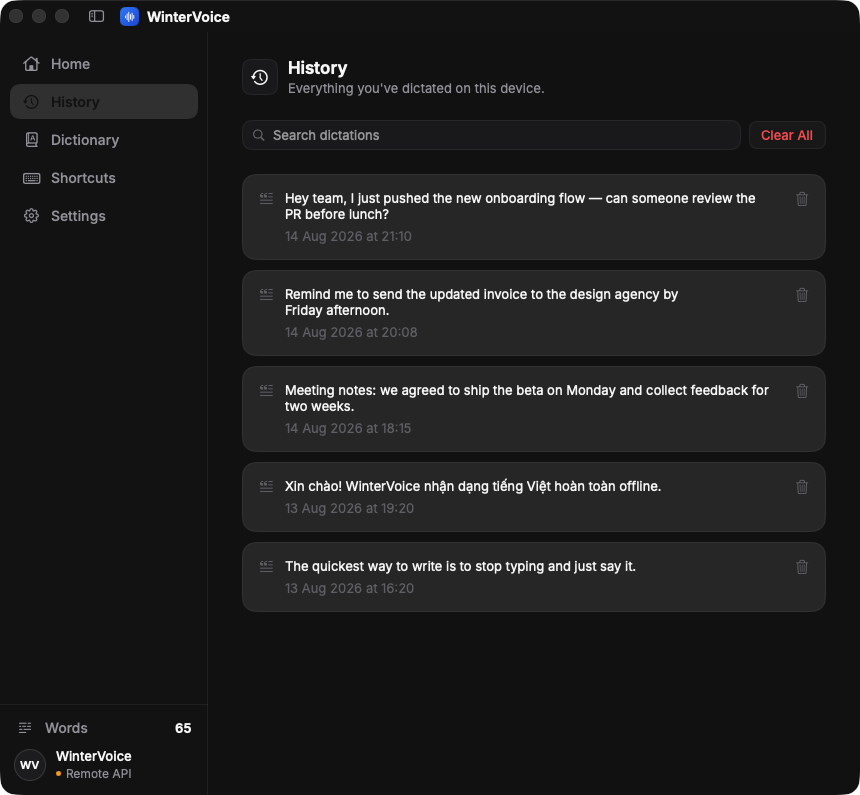
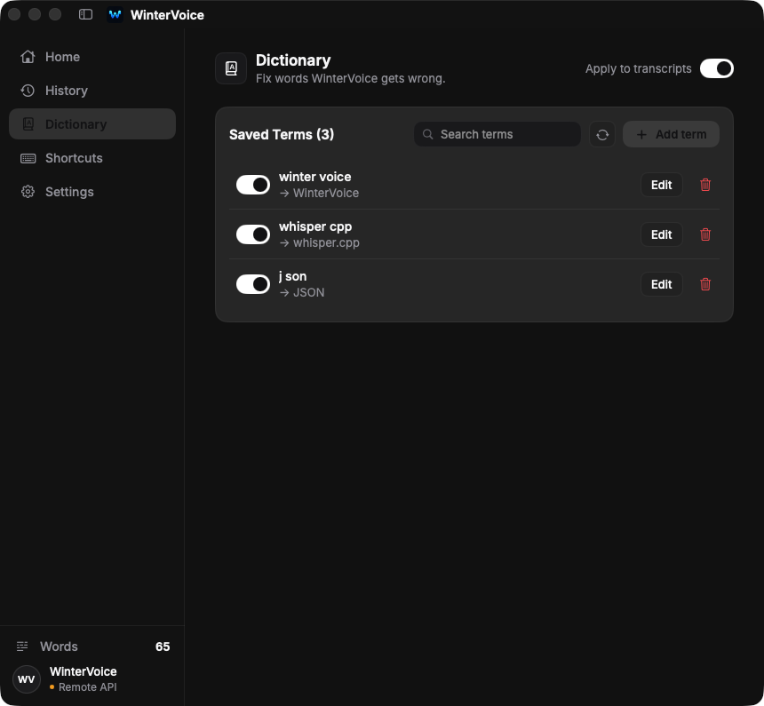
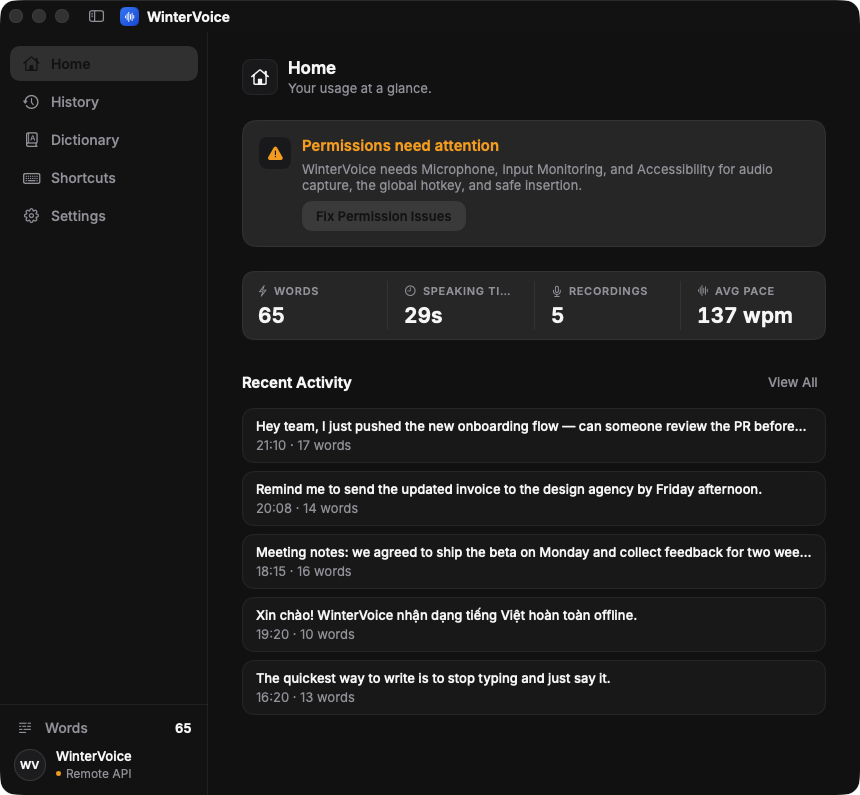
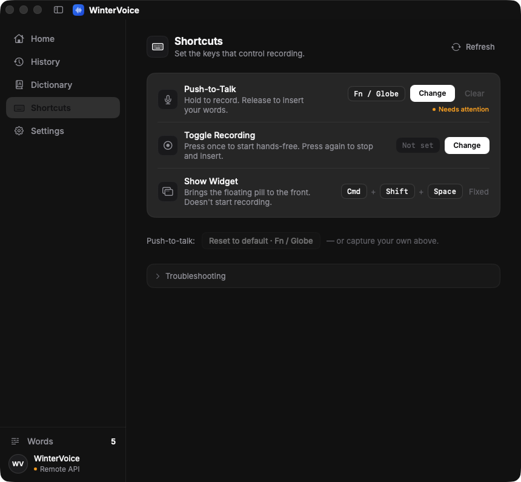

<div align="center">



# WinterVoice

**Ứng dụng đọc chính tả (dictation) mã nguồn mở, miễn phí cho macOS — chuyển giọng nói thành văn bản ngay trên máy bằng Whisper.**

Giữ phím. Nói. Thả tay. Chữ hiện ra trong bất kỳ app nào — 100% offline, không tài khoản, không trả phí.

**Tiếng Việt · English · hơn 90 ngôn ngữ**

[**⬇️ Tải cho Mac (.dmg)**](https://github.com/winterzxzz/winter_voice/releases/latest)

[](https://github.com/winterzxzz/winter_voice/releases/latest)
[](https://github.com/winterzxzz/winter_voice/releases)
[](https://github.com/winterzxzz/winter_voice/releases/latest)
[](https://github.com/winterzxzz/winter_voice/releases/latest)
[](WinterVoice)
[](https://github.com/winterzxzz/winter_voice/stargazers)

[English](README.md) · **Tiếng Việt**


</div>

---

## WinterVoice là gì?

WinterVoice là **ứng dụng nhận dạng giọng nói native cho macOS**: bạn nói, app gõ chữ vào *bất kỳ* ứng dụng nào đang mở — Slack, Notes, trình duyệt, IDE. Toàn bộ quá trình chuyển giọng nói thành văn bản chạy bằng [whisper.cpp](https://github.com/ggml-org/whisper.cpp) **ngay trên máy của bạn** — giọng nói không bao giờ rời khỏi Mac. Muốn dùng server riêng? Trỏ tới bất kỳ **API kiểu OpenAI** nào cũng được.

Đây là lựa chọn miễn phí, riêng tư thay cho các app dictation trả phí — viết bằng SwiftUI, tối ưu cho Apple Silicon, và **hỗ trợ tiếng Việt** ngon lành.

## ⬇️ Tải về

**[Tải file `.dmg` mới nhất tại trang Releases →](https://github.com/winterzxzz/winter_voice/releases/latest)**

1. Mở `WinterVoice.dmg`, kéo **WinterVoice** vào thư mục **Applications**.
2. Lần chạy đầu: app chưa được notarize nên macOS có thể cảnh báo. Hãy **chuột phải → Open → Open**, hoặc chạy:

   ```sh
   xattr -cr /Applications/WinterVoice.app
   ```

3. Làm theo trình hướng dẫn cấp quyền trong app (Micro, Input Monitoring, Accessibility) — WinterVoice chỉ cần đúng 3 quyền này, không hơn.
4. Vào trang **Transcription** tải một model Whisper (checksum được kiểm tự động) rồi bắt đầu đọc chính tả.

> Muốn tự build từ source? Xem [docs/DEVELOPMENT.md](docs/DEVELOPMENT.md).

## ✨ Tính năng

| | |
|---|---|
| 🌊 **Widget nổi với waveform trực tiếp** | Viên pill kéo-thả, luôn nổi trên cùng, đổi theo phiên đọc: logo khi nghỉ, waveform 7 thanh nhảy theo giọng khi nói, rồi tiến trình transcribe/chèn chữ. |
| 🔒 **Nhận dạng giọng nói 100% offline** | Whisper chạy trên máy. Âm thanh không bao giờ được lưu, không upload, không log. |
| ⌨️ **Phím tắt push-to-talk toàn hệ thống** | Giữ Fn/Globe (hoặc tự gán phím/tổ hợp phím bất kỳ) để đọc vào app đang focus. |
| 🇻🇳 **Hỗ trợ tiếng Việt + 90 ngôn ngữ** | Model Whisper đa ngôn ngữ kèm bộ chọn ngôn ngữ riêng — nhận dạng tiếng Việt trên Mac rất ổn. |
| 📝 **Gõ vào mọi ứng dụng** | Chèn chữ thẳng vào vị trí con trỏ qua Accessibility, có cơ chế dán dự phòng an toàn và tự khôi phục clipboard. |
| ☁️ **Tự chọn API (tuỳ chọn)** | Bất kỳ endpoint `/audio/transcriptions` kiểu OpenAI nào — server của bạn, key của bạn (lưu ngay trên máy). |
| 📚 **Từ điển cá nhân** | Tự thay thế cụm từ trước khi chèn — sửa tên riêng, thuật ngữ, lỗi Whisper hay gặp, chỉ cần cài một lần. |
| 🕘 **Lịch sử cục bộ** | Lịch sử dictation có tìm kiếm, lưu ngay trên Mac. Ô nhập mật khẩu không bao giờ bị ghi lại. |
| 🖥️ **Native & nhẹ** | App menu bar viết bằng SwiftUI, overlay ghi âm nổi. Không Electron, không telemetry, không tài khoản. |

## 📸 Ảnh màn hình

Widget nổi luôn nằm trên công việc của bạn và đổi theo phiên đọc — nghỉ, đang nghe với waveform trực tiếp, đang transcribe, đang chèn chữ:


<details>
<summary><b>▶ Tour ứng dụng (cửa sổ chính)</b></summary>
<br/>

</details>

| Lịch sử cục bộ, tìm kiếm được | Từ điển cá nhân |
|---|---|
|  |  |

| Thống kê sử dụng | Phím tắt tuỳ chỉnh |
|---|---|
|  |  |

## 🚀 Cách hoạt động

1. **Giữ** phím push-to-talk — overlay nổi hiện lên báo đang nghe.
2. **Nói** — âm thanh được thu dạng PCM mono 16 kHz, chỉ nằm trong bộ nhớ.
3. **Thả tay** — Whisper chuyển thành chữ ngay trên máy, từ điển cá nhân được áp dụng, chữ hiện ra tại con trỏ.

## 🔐 Riêng tư từ thiết kế

- Nhận dạng cục bộ dùng **whisper.cpp v1.8.3** (XCFramework pin checksum); model là bản chính thức, kiểm SHA-256.
- Âm thanh chỉ tồn tại trong RAM — **không bao giờ ghi ra đĩa**.
- Lịch sử chỉ lưu văn bản + thời gian trên máy; chữ đọc vào ô mật khẩu không bao giờ được lưu.
- Chế độ Remote là tuỳ chọn, ưu tiên HTTPS, API key lưu **ngay trên máy của bạn** trong file chỉ chủ máy đọc được.
- Đúng 3 quyền hệ thống, đều được giải thích trong app: Micro, Input Monitoring, Accessibility.

## 💻 Yêu cầu

- **macOS 14 (Sonoma) trở lên**
- **Apple Silicon** (M1/M2/M3/M4)
- ~80 MB–500 MB dung lượng cho model Whisper (Tiny/Base/Small)

## ❓ Câu hỏi thường gặp

<details>
<summary><b>WinterVoice có miễn phí không?</b></summary>
Có — miễn phí và mã nguồn mở. Không phí thuê bao, không tài khoản, không giới hạn dùng thử.
</details>

<details>
<summary><b>Có chạy offline không?</b></summary>
Có. Chế độ Local chạy whisper.cpp hoàn toàn trên máy. Chỉ cần mạng một lần duy nhất để tải model.
</details>

<details>
<summary><b>Nhận dạng tiếng Việt có tốt không?</b></summary>
Có — chọn model Whisper đa ngôn ngữ và đặt ngôn ngữ là tiếng Việt (hoặc để tự nhận diện). Model Small cho kết quả tiếng Việt tốt hơn Tiny/Base.
</details>

<details>
<summary><b>Khác gì tính năng đọc chính tả có sẵn của macOS?</b></summary>
WinterVoice có push-to-talk từ mọi app, cho bạn tự chọn model Whisper mở, có từ điển tự sửa lỗi, lịch sử tìm kiếm được, và tuỳ chọn dùng server nhận dạng riêng — tất cả đều mã nguồn mở.
</details>

<details>
<summary><b>macOS báo "không thể mở app" thì làm sao?</b></summary>
Bản build chưa được notarize. Chuột phải vào app → <b>Open</b> → <b>Open</b>, hoặc chạy <code>xattr -cr /Applications/WinterVoice.app</code> một lần.
</details>

<details>
<summary><b>Có những model Whisper nào?</b></summary>
Tiny, Base và Small — mỗi loại có bản đa ngôn ngữ (gồm tiếng Việt) và bản chỉ tiếng Anh, tải từ nguồn whisper.cpp chính thức và kiểm SHA-256.
</details>

## 🗺️ Lộ trình

- [ ] Bản phát hành có ký & notarize
- [ ] Hậu xử lý bằng LLM (dấu câu, định dạng, lệnh giọng nói)
- [ ] Hiển thị sóng âm trực tiếp
- [ ] Khởi động cùng máy
- [ ] Homebrew cask

Tài liệu kiến trúc đầy đủ: [docs/architecture-spec.md](docs/architecture-spec.md)

## 🤖 Vibe-code cùng AI

WinterVoice được xây từ đầu đến cuối bằng **vibe coding** — [Claude Code](https://claude.com/claude-code) (Claude Fable 5 của Anthropic) viết Swift, viết test, làm tooling phát hành, viết cả README này và cả pipeline dựng GIF demo; [Winter](https://github.com/winterzxzz) cầm lái sản phẩm. Bộ đồ nghề:

- **[Claude Code](https://claude.com/claude-code)** — AI pair programmer gánh toàn bộ codebase
- **codegraph MCP** — graph code-intelligence để AI tra cứu thay vì grep
- **[whisper.cpp](https://github.com/ggml-org/whisper.cpp)** — engine nhận dạng giọng nói on-device bên dưới

Muốn xem một app macOS native thuần vibe-code trông thế nào, đọc commit history — commit nào cũng có AI co-author.

## 🤝 Đóng góp

Star, issue, PR đều rất hoan nghênh — nếu WinterVoice giúp bạn đỡ phải gõ, **hãy thả ⭐ để nhiều người biết tới hơn**.

Hướng dẫn dành cho developer (build, test, checklist kiểm thử thủ công): [**docs/DEVELOPMENT.md**](docs/DEVELOPMENT.md).

## ⭐ Lịch sử star

[](https://star-history.com/#winterzxzz/winter_voice&Date)

## 📄 Giấy phép

Chưa chọn giấy phép.

---

<div align="center">
<sub><b>Từ khoá:</b> app đọc chính tả macOS · chuyển giọng nói thành văn bản Mac · gõ văn bản bằng giọng nói · nhận dạng tiếng Việt offline · whisper.cpp GUI · Whisper macOS · speech to text tiếng Việt · voice typing Mac miễn phí</sub>
</div>
